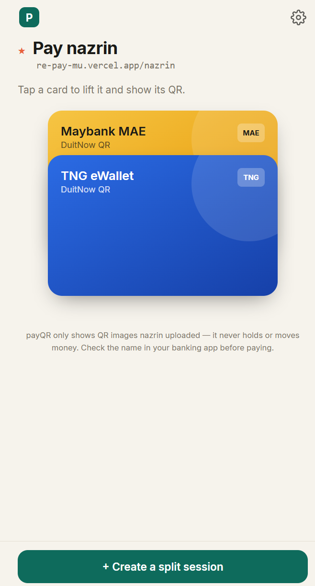
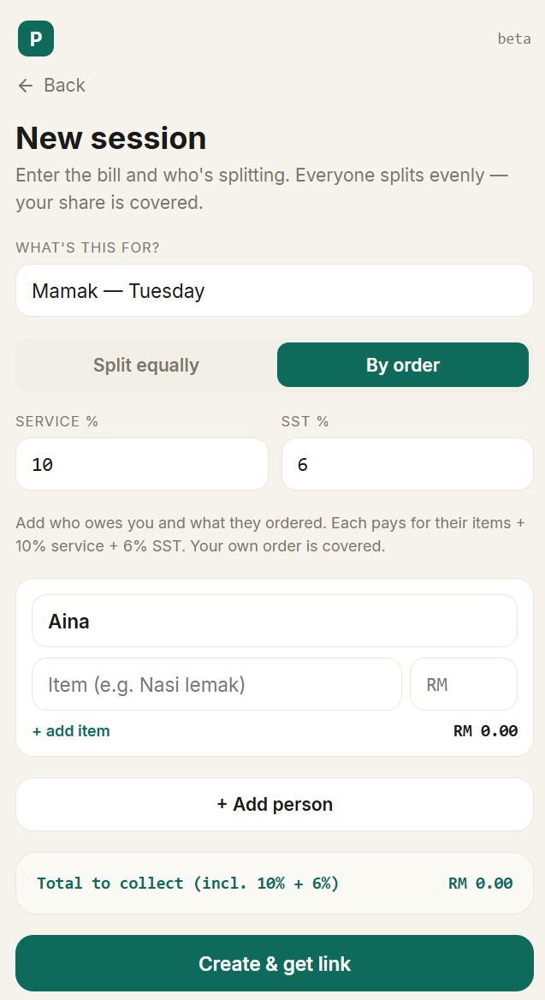

# payQR

### Get paid back.

You covered the whole table. Again. **payQR** make it easy for u to share the split digitally.

One link for all your e-wallet QRs. Split any bill in seconds. Watch the payments roll in.

---

## 😩 The problem

You pay first "for convenience." Then you spend a week being the friend who sends *"hi, RM18.66 ya 🙏"* five times. QR screenshots get buried in the chat. Nobody remembers who actually paid. *"Can u give me your QR again?"*

## ✨ Meet payQR

A pay-me page + a bill-splitter that does the awkward part for you.

> **TNG, MAE, GrabPay, etc — all on one link.** Send it once. Your friends pick a wallet, scan, done. You see exactly who's paid. payQR never holds or moves a single ringgit — it just makes getting it back effortless.

## 💡 Inspired by JomQR

payQR began with a simple idea borrowed from **[JomQR](https://jomqr.my/)** — keep all your bank & e-wallet QRs in **one place, behind one link**. Then we asked: what if it also handled the *annoying part* of group payments?

So payQR adds what comes after the scan:

- **🧮 Auto-calculated splits** — drop in the mamak bill (service charge + SST and all) and it works out exactly what each person owes — split evenly, or line-by-line by what everyone ordered.
- **💬 Straight to the group chat** — one tap sends a pay-me link into WhatsApp; everyone settles by scanning.

And it's not just for food. Housemates splitting the **monthly utility bills**, group trips that recurring "who owes what" — anywhere money needs to flow back to whoever fronted it, payQR works.

## 🎯 Why you'll love it

| | |
|---|---|
| 🪪 **All your wallets, one link** | An Apple Wallet–style card stack of every QR you own. Tap, scan, paid. |
| 🧾 **Split bills in seconds** | Even split *or* by-order (each person pays for what they ate). **Service charge + SST done for you** — no calculator, no arguments. |
| ✂️ **Just screenshot the QR** | Snap your whole banking app screen — payQR finds the QR and crops it perfectly. No fiddling. |
| 🤝 **Know who actually paid** | Friends tap *"I've paid"*, you tap *"Confirm"* when it lands. No more guessing. |
| 💸 **Friends pay their way** | They choose whichever wallet they like from your page and scan. One tap, no app to install. |
| 🔗 **Made for the group chat** | Every split comes with a ready-to-paste WhatsApp message. Drop it and you're done. |

## 🍜 Perfect for

Mamak runs · group dinners · the trip someone always fronts · **housemates splitting utilities & rent** · patungan gifts · "I'll bank in later" that never happens.

## 🔒 Built honest

payQR **never touches your money**. It only shows the QR images you upload — so it needs no banking licence, and you stay in control. The golden rule, baked into every pay screen: **check the recipient's name in your banking app before you pay.**

## 📸 Screenshots

| Your wallet page | A split session |
|---|---|
|  |  |

---

**payQR** · Pay me back, the easy way. · Made in Malaysia 🇲🇾 · Beta

